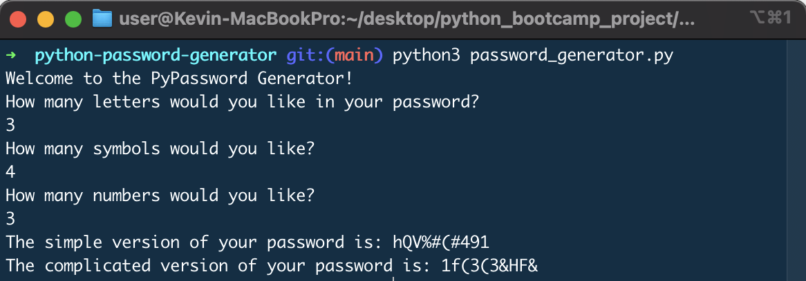

# password-generator

  [](https://opensource.org/licenses/MIT)

  ## Description
  This program allows you to generate a random password from list of letters, symbols, and numbers based on user's inputs. User will be asked to provide number of letters, symbols, and numbers for their password and it will generate random password. There are two types of passwords. First, users will be given with random password but with an order (letters, symbols, and numbers). Second, users will be given with random password but with no order (letters, symbols, and numbers are all mixed up), which will have more security.

  ## Table of Contents
  * [Installation](#installation)
  * [Usage](#usage)
  * [License](#license)
  * [Contributing](#contributing)
  * [Tests](#tests)
  * [Questions](#questions)
 
  ## Installation
  Fork this repo into your Github. Make sure the fork process has been completed without any issue by checking all files in your forked repo. If you are using VS code to run this program, make sure you have 'Python' extension installed. Feel free to use VS code or terminal to run this program.

  ## Usage
  Once you completed the installation process, it's time for you to generate your password. If you are running it from VS code, just click the 'run' button and you will be prompted. If you are running from the terminal, make sure you are located in the correct folder and type 'python3 file_name.py'. Then, you will be prompted as following:

  

  As you see above, there are two types of passwords, simple version and complicated version.
  
  ## License
  This project is covered under MIT License.

  <details>
    <summary>
      See License
    </summary> 
  
  ```
  Copyright <2022> <Kevin Choi>

  Permission is hereby granted, free of charge, to any person obtaining a copy of this software and associated documentation files (the "Software"), to deal in the Software without restriction, including without limitation the rights to use, copy, modify, merge, publish, distribute, sublicense, and/or sell copies of the Software, and to permit persons to whom the Software is furnished to do so, subject to the following conditions:
  The above copyright notice and this permission notice shall be included in all copies or substantial portions of the Software.
  
  THE SOFTWARE IS PROVIDED "AS IS", WITHOUT WARRANTY OF ANY KIND, EXPRESS OR IMPLIED, INCLUDING BUT NOT LIMITED TO THE WARRANTIES OF MERCHANTABILITY, FITNESS FOR A PARTICULAR PURPOSE AND NONINFRINGEMENT. IN NO EVENT SHALL THE AUTHORS OR COPYRIGHT HOLDERS BE LIABLE FOR ANY CLAIM, DAMAGES OR OTHER LIABILITY, WHETHER IN AN ACTION OF CONTRACT, TORT OR OTHERWISE, ARISING FROM, OUT OF OR IN CONNECTION WITH THE SOFTWARE OR THE USE OR OTHER DEALINGS IN THE SOFTWARE.
  ```
  </details>
  

  ## Contributing
  No contribution will be accepted at this moment.

  ## Questions
  If you have any questions, please contact me via

  * Email: [kevchoi1028@gmail.com](mailto:kevchoi1028@gmail.com)

  * GitHub: [https://github.com/rhwlffk1028](https://github.com/rhwlffk1028)

  * Linkedin: [https://linkedin.com/in/kevchoi](https://linkedin.com/in/kevchoi)